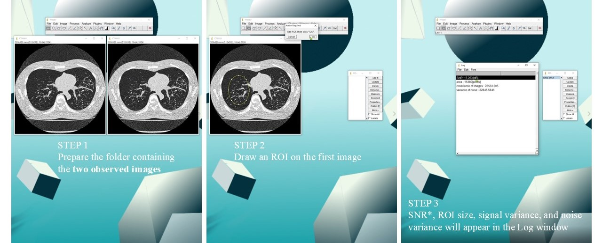
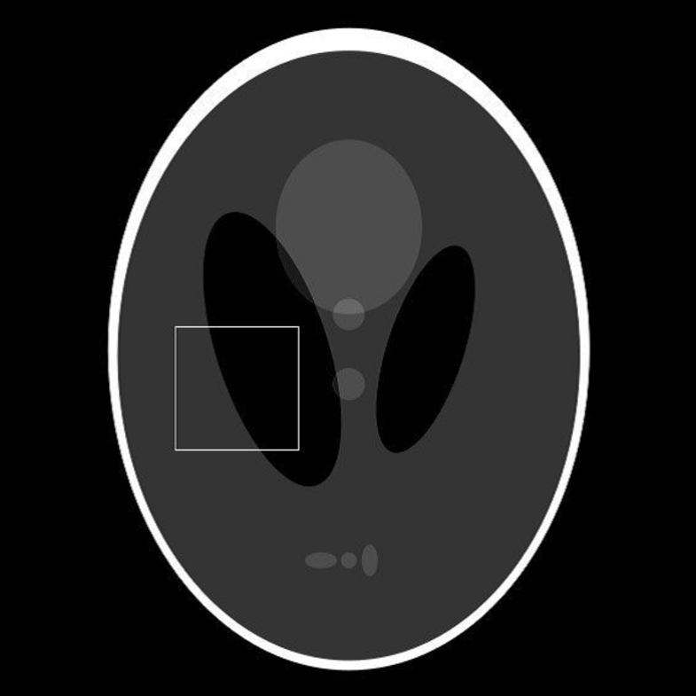
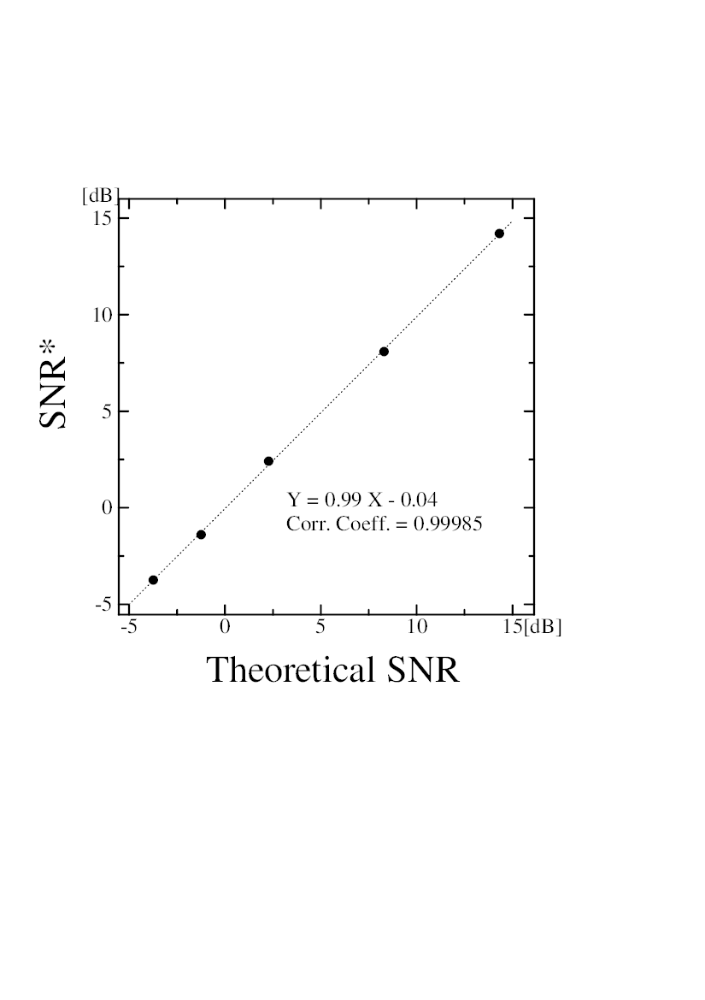

# Summary

Signal-to-noise ratio (SNR) is one of the most widely used quantitative metrics for evaluating image quality in medical imaging, microscopy, astronomy, and digital photography.

Conventional SNR measurement requires a noise-free reference image to calculate the signal variance directly. However, such reference images are generally unavailable in clinical imaging systems including X-ray computed tomography (CT), magnetic resonance imaging (MRI), and mammography.

SNR* is an ImageJ macro implementing a covariance-based SNR estimation method [@Tabuchi]. Instead of requiring an original noise-free image, the macro estimates signal variance from the covariance between two independently acquired images obtained under identical imaging conditions. Noise variance is estimated from the variance of the difference image, allowing practical SNR measurement using only repeated acquisitions.

The software is implemented entirely as an ImageJ macro and requires no additional plugins or external libraries. After selecting a region of interest (ROI) in the first image, the macro automatically transfers the ROI to the second image, calculates covariance and noise variance, and reports the SNR* value in decibels.

The implementation provides a simple and reproducible workflow for routine image quality assessment.

# Statement of need

Quantitative evaluation of image quality is essential for the development, optimization, and quality assurance of medical imaging systems. Signal-to-noise ratio (SNR) is one of the most widely used image quality metrics because it reflects the relationship between image signal and random noise.

Conventional SNR measurement methods generally require a noise-free reference image to calculate the signal variance directly. Such reference images are generally unavailable in practical medical imaging.

SNR* addresses this limitation by implementing a covariance-based SNR estimation method that requires only two independently acquired images obtained under identical imaging conditions. The software enables practical and reproducible SNR measurement without requiring access to a reference image, making it suitable for image quality evaluation, quality assurance, and imaging research.

The target users are researchers, medical physicists, radiological technologists, radiologists, and imaging scientists involved in image quality assessment, protocol optimization, and performance evaluation of medical imaging systems.

The implementation as an ImageJ macro provides an accessible and reproducible workflow without requiring additional software development or programming expertise.

# State of the field

Several methods have been proposed for estimating signal-to-noise ratio (SNR) in medical imaging. Conventional approaches typically require either a noise-free reference image, homogeneous background regions, or assumptions regarding the statistical properties of image noise. 

Among these approaches, covariance-based estimation of signal variance has also been proposed in the literature. However, to the best of our knowledge, no user-friendly implementation has been made publicly available for routine image quality assessment in medical imaging using ImageJ.

SNR* implements the covariance-based SNR estimation method described by Tabuchi et al. [@Tabuchi] as an open-source ImageJ macro. Rather than proposing a new estimation theory, the software provides an accessible and reproducible implementation that enables researchers, radiological technologists, medical physicists, radiologists, and imaging scientists to apply the published method without developing their own analysis program.

By integrating automatic ROI transfer, covariance calculation, and noise variance estimation into a single workflow, SNR* provides a practical and reproducible implementation of covariance-based SNR estimation for 
quantitative image quality evaluation in CT, MRI, mammography, and other medical imaging modalities.

# Software design

SNR* was implemented as an ImageJ macro using the built-in ImageJ macro language. ImageJ was selected because it is a widely used open-source platform for scientific image analysis, particularly in medical imaging. Implementing the software as an ImageJ macro enables platform-independent execution without compilation, plugins, or additional libraries, allowing straightforward integration into existing ImageJ workflows.

The ImageJ macro language provides built-in functions for image processing, pixel-value extraction, ROI handling, array manipulation, and mathematical calculations. These capabilities enabled efficient implementation of covariance-based SNR estimation while keeping the software compact, portable, and maintainable.

The measurement procedure consists of four principal steps:

1. Load two images acquired under identical imaging conditions.
2. Draw a region of interest (ROI) on the first image.
3. Automatically transfer the ROI to the second image.
4. Compute covariance, noise variance, and covariance-based SNR (SNR*) within the selected ROI.

The ROI is defined only once on the first image and is automatically transferred to the second image. This design minimizes user interaction, prevents inconsistent ROI placement between repeated images, and improves measurement reproducibility.

The signal variance is estimated from the covariance between the two observed images:

$$
\widehat{V(\boldsymbol{x})}=Cov(\boldsymbol{y}_1,\boldsymbol{y}_2)
$$

The noise variance is estimated from the variance of the difference image:

$$
V(\boldsymbol{n})=\frac{V(\boldsymbol{y}_1-\boldsymbol{y}_2)}{2}
$$

The covariance-based signal-to-noise ratio is calculated as:

$$
\mathrm{SNR}^{*}
=
10\log_{10}
\left(
\frac{Cov(\boldsymbol{y}_1,\boldsymbol{y}_2)}
{V(\boldsymbol{y}_1-\boldsymbol{y}_2)/2}
\right)
$$

The implementation follows the previously published covariance-based SNR theory while integrating ROI selection, covariance calculation, and noise variance estimation into a single graphical workflow.

To preserve the statistical properties of image noise, ROI transfer uses nearest-neighbor sampling rather than bilinear interpolation, avoiding artificial smoothing that could bias covariance-based SNR estimation during oblique ROI measurements.

Figure 1 summarizes the measurement workflow.

**Figure 1.** Workflow of the SNR* ImageJ macro. Two repeated images acquired under identical imaging conditions are loaded, an ROI is selected, and the macro automatically calculates covariance-based SNR*.

# Example usage

The usage of the SNR* macro was demonstrated using a numerical experiment based on the Shepp–Logan phantom.

The Shepp–Logan phantom is widely used for evaluating image reconstruction and image processing algorithms because the original signal distribution is known. In this example, the original phantom image was used as the known signal distribution, and two independent noisy images were generated by adding Gaussian noise with identical variance.

These two noisy images represent repeated acquisitions performed under identical imaging conditions.

The SNR* macro was applied to the two simulated images using a selected region of interest (ROI). The macro automatically transferred the ROI between the two images and calculated the covariance-based SNR.

**Figure 2.** Shepp–Logan phantom used for demonstration of SNR* measurement. The selected ROI was analyzed using two independently generated noisy images.

The measurement result obtained from the macro can be compared with the theoretical SNR calculated directly from the known phantom signal and the added noise component.

This example demonstrates the complete workflow of SNR* measurement, including image preparation, ROI selection, and automatic calculation using ImageJ.

# Validation

The implementation was validated using numerical simulations based on the Shepp–Logan phantom.

Because the original phantom image provides a known signal distribution, the theoretical SNR can be calculated directly from the original signal and noise components. The estimated SNR* values were compared with theoretical SNR values.

The relationship between theoretical SNR values and SNR* measurements is shown below.

**Figure 3.** Validation of covariance-based SNR estimation. The SNR* values measured by the ImageJ macro showed good agreement with theoretical SNR values calculated from the known signal and noise components.

These results demonstrate that the ImageJ implementation accurately reproduces the theoretical covariance-based SNR estimation.

# Research impact statement

To the best of our knowledge, SNR* is the first publicly available ImageJ implementation of the covariance-based SNR estimation method described by Tabuchi et al. [@Tabuchi]. By distributing the method as an open-source ImageJ macro, the software enables researchers to perform covariance-based SNR measurements without developing their own analysis programs.

The software is publicly available through GitHub and archived with a Zenodo DOI to support reproducibility, long-term accessibility, and software citation. Documentation, example images, and a usage demonstration are also provided to facilitate adoption and independent verification.

By lowering the technical barrier to covariance-based SNR estimation, SNR* facilitates reproducible image quality evaluation, quality assurance, and imaging protocol optimization in CT, MRI, mammography, and other medical imaging modalities.

The source code is freely available through GitHub:
https://github.com/Motohiro-TABUCHI/SNR_star_Tool

A permanent archived release is available through Zenodo:
https://doi.org/10.5281/zenodo.20772375

# AI usage disclosure

Generative AI (ChatGPT, OpenAI GPT-5.5) was used to assist with English editing, language refinement, and improvement of the manuscript structure. All scientific content, software design, algorithms, implementation, and technical decisions were developed, reviewed, and validated by the author.

# Acknowledgements

The author thanks the ImageJ community for valuable discussions and feedback during the development of this software. No external funding was received for this work.

# References